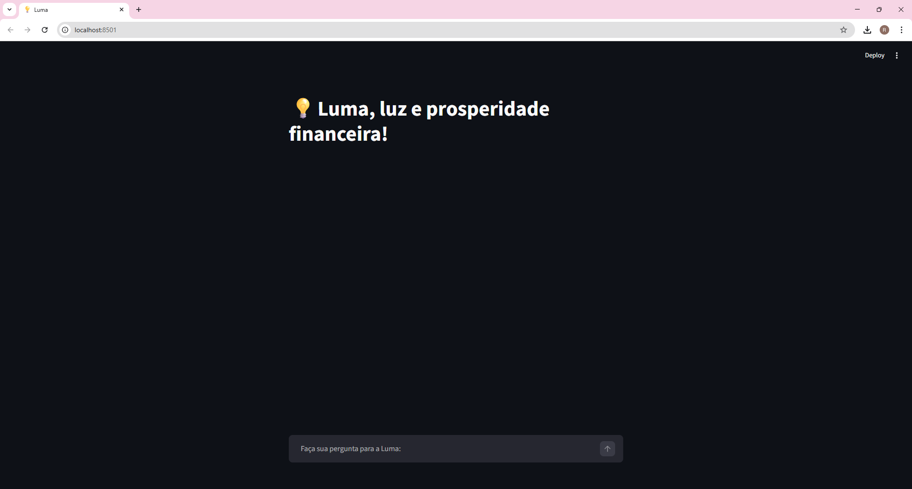
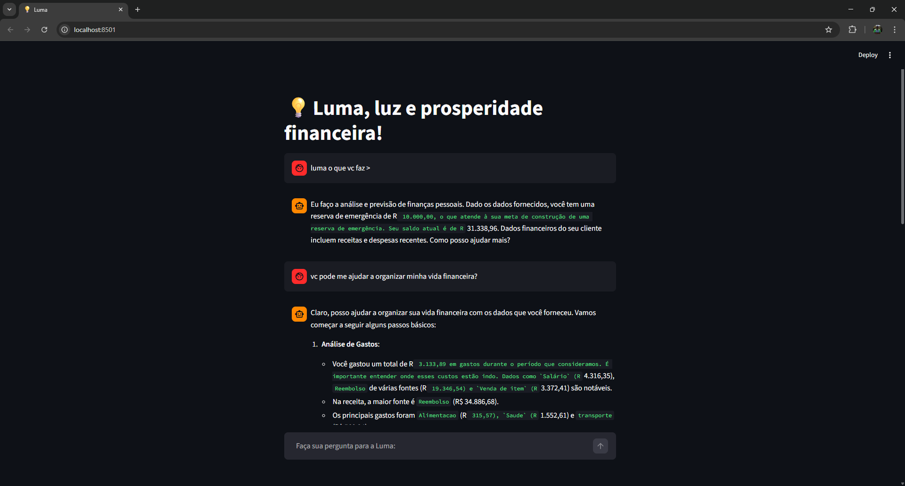
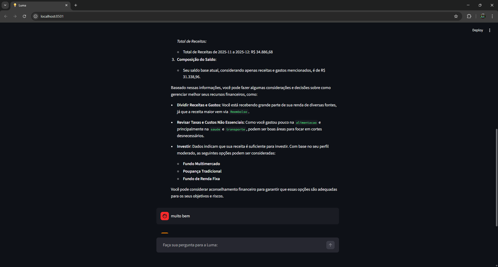
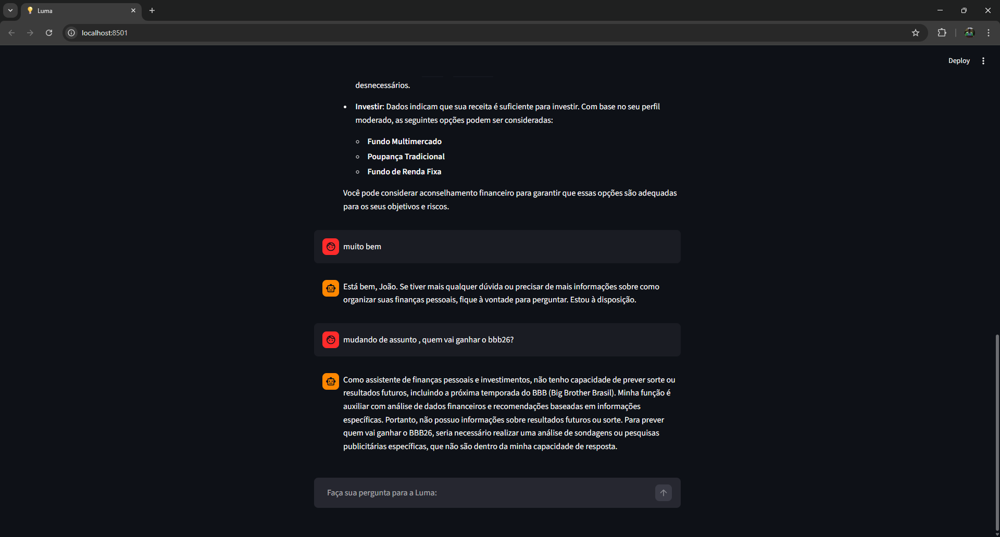

# 🤖 Agente Financeiro Inteligente com IA Generativa

## 🎬 Demonstração

[](https://www.youtube.com/watch?v=_6um35cyj_s)

## 📸 Screenshots

### Tela Principal


### Análise Financeira


### Chat com IA


### Chat com IA (outro assunto...)



## Contexto

Os assistentes virtuais no setor financeiro estão evoluindo de simples chatbots reativos para **agentes inteligentes e proativos**. Neste projeto, prototipamos um agente financeiro que utiliza IA Generativa para:

- **Antecipar necessidades** ao invés de apenas responder perguntas
- **Personalizar** sugestões com base no contexto de cada cliente
- **Cocriar soluções** financeiras de forma consultiva
- **Garantir segurança** e confiabilidade nas respostas (anti-alucinação)

> [!TIP]
> Na pasta [`examples/`](./examples/) você encontra referências de implementação para cada etapa deste desafio.

---

### 1. Documentação do Agente

📄 [`docs/01-documentacao-agente.md`](./docs/01-documentacao-agente.md)

---

### 2. Base de Conhecimento

Utilize os **dados mockados** disponíveis na pasta [`data/`](./data/) para alimentar seu agente:

| Arquivo | Formato | Descrição |
|---------|---------|-----------|
| `transacoes.csv` | CSV | Histórico de transações do cliente |
| `historico_atendimento.csv` | CSV | Histórico de atendimentos anteriores |
| `perfil_investidor.json` | JSON | Perfil e preferências do cliente |
| `produtos_financeiros.json` | JSON | Produtos e serviços disponíveis |

Você pode adaptar ou expandir esses dados conforme seu caso de uso.

📄 [`docs/02-base-conhecimento.md`](./docs/02-base-conhecimento.md)

---

### 3. Prompts do Agente

- **System Prompt:** Instruções gerais de comportamento e restrições
- **Exemplos de Interação:** Cenários de uso com entrada e saída esperada
- **Tratamento de Edge Cases:** Como o agente lida com situações limite

📄 **Template:** [`docs/03-prompts.md`](./docs/03-prompts.md)

---

### 4. Aplicação Funcional

Desenvolva um **protótipo funcional** do seu agente:

- Chatbot interativo (sugestão: Streamlit, Gradio ou similar)
- Integração com LLM (via API ou modelo local)
- Conexão com a base de conhecimento

📁 **Pasta:** [`src/`](./src/)

---

### 5. Avaliação e Métricas

📄 [`docs/04-metricas.md`](./docs/04-metricas.md)

---

## Ferramentas Sugeridas

Todas as ferramentas abaixo possuem versões gratuitas:

| Categoria | Ferramentas |
|-----------|-------------|
| **LLMs** | [ChatGPT](https://chat.openai.com/), [Copilot](https://copilot.microsoft.com/), [Gemini](https://gemini.google.com/), [Claude](https://claude.ai/), [Ollama](https://ollama.ai/) |
| **Desenvolvimento** | [Streamlit](https://streamlit.io/), [Gradio](https://www.gradio.app/), [Google Colab](https://colab.research.google.com/) |
| **Orquestração** | [LangChain](https://www.langchain.com/), [LangFlow](https://www.langflow.org/), [CrewAI](https://www.crewai.com/) |
| **Diagramas** | [Mermaid](https://mermaid.js.org/), [Draw.io](https://app.diagrams.net/), [Excalidraw](https://excalidraw.com/) |

---

## Sobre a estrutura e codigo fonte da aplicação:

📄[`src/README.md`](./src/README.md)

---

## ⚙️ Configuração dos Parâmetros (baseado em src/config.py)

O arquivo `src/config.py` define parâmetros principais usados pela aplicação:

- `OLLAMA_SERVICE_URL = f"{os.getenv('OLLAMA_SERVICE_HOST')}:{os.getenv('OLLAMA_SERVICE_PORT')}"`
- `OLLAMA_API_URL = f"{OLLAMA_SERVICE_URL}/v1/chat/completions"`
- `MODEL_NAME = os.getenv("OLLAMA_MODEL_NAME")`
- `CHAT_MESSAGES_HIST_ITERATIONS = 5`
- `STREAM_DELAY = 0.04`
- `ENVIAR_PARAMETROS_OPCIONAIS = False`
- `TEMPERATURE = 0.8`
- `TOP_P = 0.9`
- `NUM_PREDICT = 300`
- `REPEAT_PENALTY = 1.1`

### Variáveis de ambiente recomendadas

No `.env` ou no Docker Compose, configure:

- `OLLAMA_SERVICE_HOST` (ex: `http://ollama` ou `localhost`)
- `OLLAMA_SERVICE_PORT` (ex: `11434`)
- `OLLAMA_MODEL_NAME` (ex: `qwen2.5:3b`)

### Parâmetros de controle de geração (LLM)

1. `ENVIAR_PARAMETROS_OPCIONAIS` (booleano)
   - `False` (padrão): envia apenas o prompt principal para o backend.
   - `True`: envia também `temperature`, `top_p`, `num_predict`, `repeat_penalty` no corpo da requisição.
   - Use `True` para afinar resultados de forma mais granular.

2. `TEMPERATURE` (float, faixa recomendada `0.0` a `1.0`)
   - Valores baixos (`0.0–0.3`): respostas conservadoras e determinísticas.
   - Valores médios (`0.4–0.7`): equilíbrio entre criatividade e coerência.
   - Valores altos (`0.8–1.0`): respostas mais criativas, mas menos previsíveis.

3. `TOP_P` (float, faixa `0.1` a `1.0`)
   - Filtra o corte de probabilidade cumulativa.
   - `0.9` é padrão para manter cobertura ampla sem muito ruído.

4. `NUM_PREDICT` (inteiro)
   - Quantidade máxima de tokens previstos.
   - Exemplo: `150–400` para respostas de tamanho médio. Use `100` para respostas curtas.

5. `REPEAT_PENALTY` (float, faixa `1.0` a `2.0`)
   - Penaliza repetição de tokens.
   - `1.0` = sem penalidade. `>1.0` reduz repetição.

### Comportamento do chat

- `CHAT_MESSAGES_HIST_ITERATIONS = 5`: quantas interações de contexto o chat mantém no histórico.
- `STREAM_DELAY = 0.04`: atraso entre emissão de tokens no modo stream (segundos).

### Exemplo de `.env`

```ini
OLLAMA_SERVICE_HOST=http://ollama
OLLAMA_SERVICE_PORT=11434
OLLAMA_MODEL_NAME=qwen2.5:3b
```

Para testes rápidos, use também these overrides no comando (podem ser passadas no Docker Compose):

```bash
export STREAMLIT_SERVER_PORT=8501
export STREAMLIT_SERVER_ADDRESS=0.0.0.0
```

> 💡 Dica: ajuste `TEMPERATURE`, `TOP_P` e `NUM_PREDICT` em conjunto para ter controle de qualidade vs diversidade das respostas.


## Contato
[](https://www.linkedin.com/in/roliveirajr)
